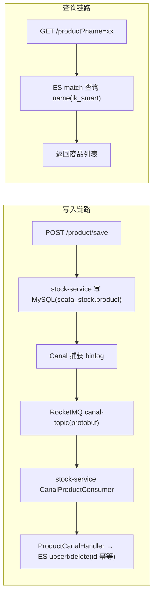

# 设计方案：stock-service 商品功能（MySQL + Canal → ES 同步，ES 按名称检索）

> 状态：**待评审**（2026-08-18）——评审通过后进入编码
>
> 需求要点：
> 1. stock-service 新增**商品管理**：一个 Controller，支持**保存商品**与**按商品名称查询**；
> 2. 商品写入 **MySQL**，通过 **Canal → RocketMQ** 实时同步到 **ES**；ES 中 `name` 字段使用 `analyzer = "ik_max_word"`、`searchAnalyzer = "ik_smart"`；
> 3. **按名称查询走 ES**（全文检索）；
> 4. 商品字段：`id / name / brand / price / description / create_time`；
> 5. MySQL、Canal、RocketMQ、ES 均已搭建并启动，本期不涉及基建。

## 0. 基础设施事实核查（已实测确认）

| 项 | 现状 | 说明 |
| --- | --- | --- |
| MySQL | 127.0.0.1:3306，`seata_stock` 库 | stock-service 现有数据源，直接复用 |
| Canal | 1.1.8，`serverMode=rocketMQ` | `instance.filter.regex` 已含 `seata_stock\\..*`，**新建 product 表后 DML 自动进 binlog，无需改 Canal 配置** |
| Canal 消息格式 | `flatMessage=false`（**protobuf**） | RocketMQ 消息体是 `CanalPacket.Packet`，与 user-service 现有消费方式一致（课程示例的 JSON flatMessage 与本机配置不符，按 protobuf 实现） |
| RocketMQ | 127.0.0.1:9876，topic=`canal-topic` | user-service 已消费该 topic；新增消费组即可，同 topic 多消费组各收全量、按库表路由过滤 |
| ES | 8.18.1，127.0.0.1:9200 | **IK 插件已安装**（`analysis-ik 8.18.1`），`ik_max_word / ik_smart` 可直接使用 |

## 1. 总体架构



要点：

- **数据权威在 MySQL，ES 是查询副本**：写路径只写 MySQL，ES 由 Canal 异步同步（最终一致）；
- **查询路径只读 ES**：按名称全文检索走 `match` 查询（索引分词 `ik_max_word`，查询分词 `ik_smart`）；
- 同步消费者放在 **stock-service 内部**（不新建 es-sync-service），与"stock-service 新增商品功能"的需求一致；
- 不引入 Seata 分布式事务：保存商品是单库单表写入；Canal 同步是异步最终一致，天然不受本地事务约束。

## 2. 数据设计

### 2.1 MySQL 表（Flyway V2）

```sql
CREATE TABLE IF NOT EXISTS product (
    id          BIGINT PRIMARY KEY,              -- 雪花 ID，服务端生成
    name        VARCHAR(128) NOT NULL,           -- 商品名称（搜索主字段）
    brand       VARCHAR(64)  NOT NULL,           -- 品牌
    price       DECIMAL(10,2) NOT NULL,          -- 价格（分以下两位）
    description VARCHAR(512) NOT NULL DEFAULT '',-- 描述
    create_time DATETIME     NOT NULL DEFAULT CURRENT_TIMESTAMP,
    KEY idx_product_name (name)                  -- MySQL 兜底查询/按名精确查
) ENGINE = InnoDB DEFAULT CHARSET = utf8mb4;
```

### 2.2 ES 索引（index: `product`）

mapping 设计：

| 字段 | ES 类型 | 说明 |
| --- | --- | --- |
| `id` | `long` | 文档主键，与 MySQL id 一致 |
| `name` | `text`，`analyzer=ik_max_word`，`searchAnalyzer=ik_smart` | **需求指定**：索引最细粒度、查询粗粒度 |
| `brand` | `keyword` | 精确匹配/聚合，不分词 |
| `price` | `double` | 演示用；生产可换 `scaled_float` 避免精度问题 |
| `description` | `text`，`analyzer=ik_max_word`，`searchAnalyzer=ik_smart` | 中文描述可检索（需求未强制，推荐开启） |
| `createTime` | `date`，format `yyyy-MM-dd HH:mm:ss\|\|epoch_millis` | 直接存 MySQL 传来的字符串，格式兼容 |

索引初始化：**启动时幂等创建**（`IndexOperations.exists` → 不存在则按实体注解创建）。mapping 变更需重建索引（学习环境直接删建，文档留痕）。

## 3. 依赖与配置

### 3.1 stock-service pom 新增

```xml
<!-- ES：Spring Data Elasticsearch（Boot BOM 管理 elasticsearch-java 8.18.8，与服务端 8.18.1 同 minor） -->
<dependency>
    <groupId>org.springframework.boot</groupId>
    <artifactId>spring-boot-starter-data-elasticsearch</artifactId>
</dependency>
<!-- RocketMQ 消费（与 user-service 同版本管理） -->
<dependency>
    <groupId>org.apache.rocketmq</groupId>
    <artifactId>rocketmq-spring-boot-starter</artifactId>
    <exclusions>
        <exclusion>
            <groupId>org.lz4</groupId>
            <artifactId>lz4-java</artifactId>
        </exclusion>
    </exclusions>
</dependency>
<dependency>
    <groupId>at.yawk.lz4</groupId>
    <artifactId>lz4-java</artifactId>
</dependency>
<!-- Canal 非 flat 消息（Entry protobuf）解析，与 user-service 一致 -->
<dependency>
    <groupId>com.alibaba.otter</groupId>
    <artifactId>canal.protocol</artifactId>
    <version>1.1.8</version>
</dependency>
```

### 3.2 application.yml 新增

```yaml
spring:
  elasticsearch:
    uris: http://127.0.0.1:9200
    connection-timeout: 3s
    socket-timeout: 10s

rocketmq:
  name-server: 127.0.0.1:9876
```

## 4. Canal 消费链路设计（复用 user-service 模式）

user-service 已实现一整套"非 flat protobuf → 按行拆分 → 按 database.table 路由 → 表 Handler"的消费框架，本功能在 stock-service **复制同一套**（服务自治；将来出现第三个消费者时再抽取到 sca-common）：

```
CanalSyncConsumer(canal-topic, 消费组 canal-product-consumer)
  → CanalPacketParser（protobuf → Message）
  → CanalEventConverter（Entry → 行级 CanalEvent，含位点）
  → 按 routeKey 路由到 TableSyncHandler
```

新增 `ProductCanalHandler`：

- `supportedKeys()`：`{"seata_stock.product"}`；
- `idempotent()`：默认 **true**（ES 按 id 覆盖 upsert / deleteById 天然幂等，无需 sync_log 去重表）；
- `handle(message)`：
  - `INSERT / UPDATE` → 从 `data` 取行数据 → 转 `ProductDocument` → `repository.save`（按 id 覆盖）；
  - `DELETE` → `repository.deleteById(id)`；
- 消费异常向上抛出 → RocketMQ 重试（at-least-once + 幂等保证最终一致）。

注意：消费组名与 user-service 的 `canal-consumer` **不同**（如 `canal-product-consumer`），两个服务各自收到全量 binlog 消息，按路由 key 各取所需。

## 5. 接口设计

### 5.1 保存商品 `POST /product/save`

请求：

```json
{ "name": "华为 Mate 70 Pro", "brand": "华为", "price": 6999.00, "description": "麒麟芯片旗舰手机" }
```

响应：`Result<Product>`（id 雪花生成，create_time 由 DB 填充后回查）。

校验：`name`/`brand` 非空且长度受限、`price >= 0`、`description` 长度受限。

### 5.2 按名称查询 `GET /product?name=华为`

- 主路径：ES `match` 查询 `name` 字段（查询分词 `ik_smart`），返回 `Result<List<Product>>`；
- **降级兜底（决策点，推荐开启）**：ES 不可用时降级 MySQL `name LIKE '%关键词%'` 并打告警日志，保证查询接口不因 ES 故障而挂；主路径仍是 ES，符合需求语义；
- 刚保存的商品有秒级同步延迟，立即查询可能查不到（最终一致，文档与接口说明中标注）。

领域模型统一使用 `Product`（domain），ES 内部使用 `ProductDocument`（`@Document` 注解类），Service 层做 1:1 转换，避免 API 暴露 ES 注解类。

## 6. 测试方案

1. `ProductMapperXmlTest`（H2）：`insertProduct` / `selectById` / `selectByNameLike` 往返；
2. `ProductCanalHandlerTest`：构造 INSERT/UPDATE/DELETE 的 `CanalMessage`，断言 ES repository 的 `save/deleteById` 调用与字段映射正确；
3. `ProductServiceTest`：保存（雪花 id + 入库、不直接写 ES）、查询（match 查询构造、ES 故障降级 MySQL）；
4. 端到端手测（依赖已启动的基建）：
   - `POST /product/save` → 等 1~2s → 直连 ES `_search` 验证文档存在；
   - ES `_analyze` 验证 `ik_max_word / ik_smart` 分词效果；
   - `GET /product?name=华为` 命中（验证"查的是 ES"，可在保存后停掉 MySQL 只留 ES 仍能查到）；
5. 回归 stock-service 现有测试。

## 7. 风险与注意事项

| 风险 | 影响与应对 |
| --- | --- |
| Canal 消息格式 | 本机 `flatMessage=false`，消息是 **protobuf** 而非课程示例的 JSON；按 user-service 已验证的 protobuf 链路实现 |
| ES 版本兼容 | ES 8.18.1 与 Boot 3.5.16 管理的 elasticsearch-java 8.18.8 同 minor；Spring Data Elasticsearch 5.5.x（spring-data-bom 2025.0.13）面向 ES 8.17/8.18 系列，属 Boot 官方组合，兼容性风险低 |
| 最终一致窗口 | 保存后秒级内查不到属正常；消费失败走 MQ 重试；生产兜底三板斧（死信/对账/全量重建）列为后续扩展 |
| 索引 mapping 变更 | 需重建索引（先删后建会短暂丢数据）；学习环境直接重建即可，生产应走 alias 重建 |
| price 精度 | ES 用 `double` 仅演示；金额敏感场景生产改 `scaled_float` |
| 消费端写入失败 | 抛异常交给 RocketMQ 重试；ES upsert 按 id 幂等，重复消费无副作用 |
| MySQL 兜底查询 | `LIKE '%x%'` 不走索引，仅降级路径使用；主路径 ES，量级不受影响 |

## 8. 变更文件清单

**修改**

| 文件 | 说明 |
| --- | --- |
| `stock-service/pom.xml` | 新增 spring-boot-starter-data-elasticsearch、rocketmq-spring-boot-starter、canal.protocol、lz4-java |
| `stock-service/src/main/resources/application.yml` | 新增 `spring.elasticsearch.uris`、`rocketmq.name-server` |

**新增**

| 文件 | 说明 |
| --- | --- |
| `stock-service/src/main/resources/db/migration/V2__add_product.sql` | 建 `product` 表 |
| `com.example.stock.domain.Product` | 商品实体（MyBatis-Plus） |
| `com.example.stock.mapper.ProductMapper` + `mapper/ProductMapper.xml` | insert / selectById / selectByNameLike |
| `com.example.stock.dto.ProductSaveRequest` | 保存请求体（record） |
| `com.example.stock.es.ProductDocument` | ES 文档（`@Document` + `@Field`，name 配 ik 分词） |
| `com.example.stock.es.ProductRepository` | `ElasticsearchRepository<ProductDocument, Long>` |
| `com.example.stock.es.ProductIndexInitializer` | 启动幂等创建索引 |
| `com.example.stock.mqconsumer.canal.*` | 复制 user-service 的 protobuf 解析链路（Parser/Converter/Event/Message/Handler 接口） |
| `com.example.stock.mqconsumer.CanalProductConsumer` | `@RocketMQMessageListener(canal-topic, canal-product-consumer)` |
| `com.example.stock.mqconsumer.canal.ProductCanalHandler` | product 表变更 → ES upsert/delete |
| `com.example.stock.service.ProductService` | 保存（雪花 id）/ 按名查询（ES + MySQL 降级） |
| `com.example.stock.controller.ProductController` | `POST /product/save`、`GET /product` |
| 测试：`ProductMapperXmlTest` / `ProductCanalHandlerTest` / `ProductServiceTest` | 见第 6 节 |
| 本文档 | 设计方案 |

## 9. 本期不做（明确范围外）

- 独立 es-sync-service（同步消费者暂放 stock-service 内）；
- 死信队列、MySQL ↔ ES 定时对账、全量重建索引脚本（一致性兜底三板斧，后续扩展）；
- 商品上下架状态、库存联动（库存表已存在，本期不打通）；
- ES 分页/排序/高亮增强（先做基础 match 查询）。
