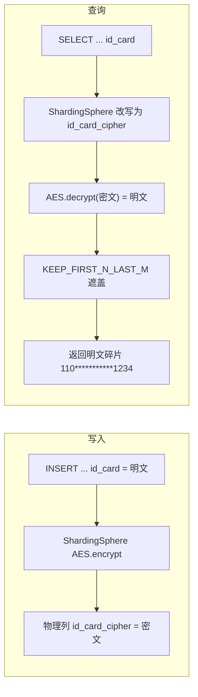

# 设计方案：users 表身份证号加密存储 + 明文碎片展示（ShardingSphere ENCRYPT + MASK）

> 状态：**待评审**（2026-08-17）——评审通过后进入编码
>
> 需求要点：
> 1. `users` 表新增 `id_card`（身份证号）：**加密存储**（库内不落明文），客户端展示**明文碎片**（如 `110***********1234`）；
> 2. `UserController` 新增**保存用户**接口；
> 3. 改造现有 `GET /user?id=` 接口，返回**用户全部信息**（含脱敏后的 `idCard`）；
> 4. 使用 **ShardingSphere 数据脱敏**实现（统一 ShardingSphere 数据源下，ENCRYPT 加密 + MASK 脱敏组合）；
> 5. **字段约定（本次新增规定）**：`id_card` 不能为 null，默认空字符串——落库密文列 `NOT NULL DEFAULT ''`，查询返回永不 null（老数据为空串）。

## 0. 与现有架构的关系

本方案基于 user-service 当前**统一 ShardingSphere 数据源**（v2 形态）实现：

- 全库走 `ShardingSphereDriver` + `shardingsphere.yaml`；不分表的 `users` 表由 `!SINGLE` 规则穿透到 `ds0`；
- 本次在 `!SINGLE`/`!SHARDING` 之上**追加 `!ENCRYPT` 与 `!MASK` 两条规则**，只作用于 `users.id_card`，其余表不受影响；
- **不引入 Seata、不引入分布式事务**：保存用户为单表单条 SQL，本地事务即可；加密/脱敏全部由 ShardingSphere 在 SQL 改写与结果装饰层完成。

## 1. 为什么用 ShardingSphere ENCRYPT + MASK，而不是应用层加密

| 方案 | 说明 | 结论 |
| --- | --- | --- |
| 应用层手动加密/脱敏 | Service 里 AES 加密写入、解密后自行 `substring + *` 拼接 | 业务代码侵入大、每处查询都要记得解密/脱敏，容易漏 |
| ShardingSphere ENCRYPT（加密） | SQL 面向**逻辑列 `id_card`** 编写，框架自动改写为**物理密文列 `id_card_cipher`**：写入加密、读取解密 | 透明、无侵入，与统一数据源架构天然一致 |
| ShardingSphere MASK（脱敏） | 在查询结果装饰层按算法把明文遮盖为碎片 | 与 ENCRYPT **同一字段可共存**：先解密（encrypt order）再脱敏（mask order） |

官方 e2e（`test/e2e/sql/.../scenario/mask_encrypt/rules.yaml`）即为 ENCRYPT + MASK 同字段共存的真实示例（同一逻辑列同时配置 `cipher` 与 `maskAlgorithm`），5.5.3 直接支持。

## 2. 数据设计

### 2.1 物理列与逻辑列

| 概念 | 列名 | 类型 | 说明 |
| --- | --- | --- | --- |
| 物理列（库内真实存在） | `id_card_cipher` | `VARCHAR(128) NOT NULL DEFAULT ''` | 只存 AES 密文（Base64），**永不存明文**；`VARCHAR(128)` 对 18 位身份证加密结果（约 44 字符）富余 |
| 逻辑列（面向业务 SQL） | `id_card` | 虚拟列，无物理列 | 业务/实体/XML 只写 `id_card`，由 `!ENCRYPT` 规则映射到 `id_card_cipher` |

### 2.2 V6 迁移（Flyway 直连物理库执行）

```sql
-- user-service/src/main/resources/db/migration/V6__add_id_card_encryption.sql
-- 身份证密文列：非空、默认空串（老数据自动回填 ''），不落明文
ALTER TABLE users
    ADD COLUMN id_card_cipher VARCHAR(128) NOT NULL DEFAULT '' COMMENT '身份证号密文(AES)';
```

- 老数据：`DEFAULT ''` 由 MySQL 在 ALTER 时自动回填，无需应用层回填脚本；
- 回填/迁移策略：**不反向回填明文**（历史用户无身份证信息，语义上即"未录入"），展示空串由前端处理（如显示"未录入"）。

### 2.3 非空与空串约定（本次新增规定）

- **物理层**：`id_card_cipher NOT NULL DEFAULT ''`，任何绕过逻辑层的写入（如直连 SQL）也不会产生 null；
- **应用层**：保存用户时 `idCard` 允许为空；为空/缺失统一规范化为空字符串落库（`AES.encrypt('') = ''`，与 DB 默认值两条路径结果一致）；
- **查询层**：老数据与空值均返回 `idCard = ""`，**永不返回 null**（已核实源码行为：`AES.decrypt('') = ''`，`KEEP_FIRST_N_LAST_M.mask('') = ''`）。

## 3. ShardingSphere 规则设计（`shardingsphere.yaml`）

在现有 `rules:` 中追加 `!MASK` 与 `!ENCRYPT` 两段（参照官方 e2e 顺序：SINGLE → MASK → ENCRYPT；实际结果装饰顺序由规则 Order 固定为"先解密、后脱敏"，与声明顺序无关）：

```yaml
rules:
  - !SINGLE
    tables:
      - "*.*"
    defaultDataSource: ds0

  - !SHARDING
    tables:
      user_behavior:
        # ... 现有分表规则不变

  # 身份证号脱敏：查询结果在解密后遮盖为明文碎片（3 位 + * + 4 位）
  - !MASK
    tables:
      users:
        columns:
          id_card:
            maskAlgorithm: id-card-keep-first-3-last-4
    maskAlgorithms:
      id-card-keep-first-3-last-4:
        type: KEEP_FIRST_N_LAST_M
        props:
          first-n: 3
          last-m: 4
          replace-char: '*'

  # 身份证号加密：逻辑列 id_card ↔ 物理密文列 id_card_cipher，AES 可逆加密
  - !ENCRYPT
    tables:
      users:
        columns:
          id_card:
            cipher:
              name: id_card_cipher
              encryptorName: id-card-aes
    encryptors:
      id-card-aes:
        type: AES
        props:
          aes-key-value: ${ID_CARD_AES_KEY:change-me-in-prod}
          digest-algorithm-name: SHA-1
```

要点：

1. **脱敏算法**：`KEEP_FIRST_N_LAST_M`（保留前 3 后 4，中间 `*` 遮盖）。18 位身份证展示为 `110***********1234`（3 + 11 个 `*` + 4）；
2. **加密算法**：内置 `AES`（可逆），`digest-algorithm-name: SHA-1` 将任意长度密钥摘要为 AES 可用密钥；
3. **密钥管理**：开发环境可用占位符回退值；**生产必须通过环境变量/配置中心注入 `ID_CARD_AES_KEY`，建议 KMS 托管**，且密钥变更会导致历史密文不可解密（见风险）；
4. **不配置 `transaction` 段**（沿用现状，默认 LOCAL），不触发分布式事务 SPI；
5. `!ENCRYPT` 默认 `queryWithCipherColumn=true`：SELECT 自动走密文列并解密，无需额外配置。

## 4. 处理流程



- 写入：逻辑列明文 → 框架加密 → 密文落库（库内无明文）；
- 查询：物理密文列 → 框架解密 → 脱敏碎片返回客户端（客户端永远拿不到完整明文）。

## 5. 代码设计

### 5.1 依赖（pom.xml）

当前 user-service 只引入了 sharding/single 相关模块，**缺少加密与脱敏功能模块**，需新增（版本统一 5.5.3）：

```xml
<dependency>
    <groupId>org.apache.shardingsphere</groupId>
    <artifactId>shardingsphere-encrypt-core</artifactId>
</dependency>
<dependency>
    <groupId>org.apache.shardingsphere</groupId>
    <artifactId>shardingsphere-mask-core</artifactId>
</dependency>
```

> 父 POM `dependencyManagement` 目前未管理这两个 artifact，编码时在父 POM 补两行版本管理（`${shardingsphere.version}`）或在 user-service 显式写版本。

### 5.2 实体 `User`

```java
private String idCard;   // 逻辑字段：读取为脱敏碎片；写入为明文（框架加密）
```

### 5.3 Mapper 与 XML（面向逻辑列）

```xml
<select id="selectUserById" resultType="com.example.user.domain.User">
    SELECT id, nickname, points, credits, create_time, id_card
    FROM users
    WHERE id = #{id}
</select>

<insert id="insertUser" parameterType="com.example.user.domain.User">
    INSERT INTO users (id, nickname, points, credits, id_card)
    VALUES (#{id}, #{nickname}, #{points}, #{credits}, #{idCard})
</insert>
```

- `id_card` 为逻辑列，SQL 改写由 ShardingSphere 完成；
- `create_time` 不写入，由 DB 默认值 `CURRENT_TIMESTAMP` 填充，插入后回查返回完整记录（沿用 `ShardingUserBehaviorService.create` 的做法）；
- **不使用 `BaseMapper.insert`**：MP 自动生成的列清单含 `id_card`，虽然理论上可被 ENCRYPT 改写，但项目惯例是人工维护 XML 显式列、行为可预期，故新增 `insertUser` XML。

### 5.4 Service `UserService`

- `getUserInfo` 改造：返回 `User`（含脱敏 `idCard`）；Sentinel `blockHandler`/`fallback` 相应改为返回 `User`（null 由 Controller 兜底）；
- 新增 `saveUser`：
  - `id` 用 sca-common `SnowflakeIdGenerator`（本机固定 `machineId=3`，与 `ShardingUserBehaviorService` 一致；多实例部署时改为配置注入）；
  - 参数校验：`nickname` 非空且 ≤64；`idCard` 可空，非空时校验 18 位身份证格式（正则），**空/缺失规范化为 `""`**；
  - 插入后按 id 回查，返回完整 `User`。

### 5.5 Controller `UserController`

```java
@PostMapping("/user/save")                       // 新增：保存用户
public Result<User> save(@RequestBody UserSaveRequest request)

@GetMapping("/user")                             // 改造：返回全部信息（含脱敏 idCard）
public Result<User> user(@RequestParam String id)
```

`UserSaveRequest`：`record UserSaveRequest(String nickname, String idCard) {}`（与 `UserBehaviorCreateRequest` 风格一致）。

## 6. 接口契约

### 6.1 新增 `POST /user/save`

请求：

```json
{ "nickname": "zhangsan", "idCard": "110101199003071234" }
```

响应（`Result<User>`，`idCard` 为脱敏碎片）：

```json
{
  "code": 0,
  "message": "success",
  "data": {
    "id": 87129840123456789,
    "nickname": "zhangsan",
    "points": 0,
    "credits": 0,
    "createTime": "2026-08-17T10:00:00",
    "idCard": "110***********1234"
  }
}
```

### 6.2 改造 `GET /user?id=1`

- 返回 `Result<User>` 全字段（id / nickname / points / credits / createTime / idCard 脱敏值）；
- **破坏性变更**：原接口返回 `String`（`"user:1 nickname=demo points=100"`），改造后返回 JSON 结构，调用方需适配（本仓库无内部调用方，风险可控，但需在提交说明中标注）；
- 老数据（`id_card_cipher=''`）返回 `idCard: ""`，**不返回 null**。

## 7. 测试方案

### 7.1 新增 ShardingSphere ENCRYPT+MASK 集成测试（H2，不启动 Spring）

新增 `UserEncryptMaskTest` + 测试 YAML（`user-encrypt-mask-test.yaml`，ds0 指向 H2 内存库，`rules` 含 SINGLE + MASK + ENCRYPT），H2 中 `users` 物理表只建 `id_card_cipher` 列，验证：

1. **写入加密**：经逻辑列 `id_card` 插入明文 → 直连 rawDataSource 查 `id_card_cipher` 为密文（≠ 明文，且可 AES 解密回明文）；
2. **查询脱敏**：`SELECT id_card` 返回 `110***********1234`；
3. **空串约定**：`id_card_cipher = ''` 的老数据 → 查询返回 `""`（非 null，不抛异常）；
4. 空 `idCard` 保存 → 落库 `''`，查询返回 `""`。

### 7.2 调整 `UserMapperXmlTest`

- H2 建表语句增加 `id_card VARCHAR(128) NOT NULL DEFAULT ''` 列（纯 MyBatis 直连，物理存在逻辑列以通过 XML 映射校验）；
- 新增 `insertUser` 往返用例（插入后 `selectUserById` 能取回 `idCard`）；
- 说明：该测试只验证 XML/实体映射，真实"加密→脱敏"链路由 7.1 的 ShardingSphere 集成测试覆盖。

### 7.3 其余

- `UserControllerTest`（MockMvc，mock service）：新增 save 成功/参数非法用例，user 接口返回结构用例；
- 回归 user-service 现有全部测试（当前 87 个），并保持 `ShardingUserBehaviorRoutingTest` 不变。

## 8. 风险与注意事项

| 风险 | 影响与应对 |
| --- | --- |
| 密钥泄露 | 密钥外置于环境变量/配置中心/KMS；**密钥轮换会使历史密文无法解密**，轮换需配套数据重加密方案（本期不做，文档留痕） |
| 加密列不可直接查询 | 密文列无法按身份证等值/模糊/范围检索，也不可建唯一索引；本期无此需求，如需则走 `assistedQuery`（MD5 等值辅助列），属于后续扩展 |
| 脱敏算法对短串原样返回 | `KEEP_FIRST_N_LAST_M` 在长度 < firstN+lastM 时**不遮盖**；通过保存接口强制 18 位格式校验规避明文泄露 |
| `GET /user` 破坏性变更 | 返回 String → `Result<User>` JSON；文档与提交说明中标注，仓库内无内部调用方 |
| 老数据语义 | `id_card_cipher=''` 无法区分"未录入"与"空值"（身份证无空值场景）；展示层约定空串显示"未录入" |
| 新增依赖 | `shardingsphere-encrypt-core` / `shardingsphere-mask-core` 与现有 5.5.3 模块同版本，需在父 POM dependencyManagement 补管理，避免版本漂移 |
| 解析开销 | `users` SQL 多一次进程内解析与结果装饰（微秒级），统一数据源既有取舍，可接受 |
| 事务 | 单表单条 SQL，无分布式事务需求；如未来与分表表同事务，统一数据源下 LOCAL 事务即可覆盖（同物理库），不引入 Seata |

## 9. 变更文件清单

**修改**

| 文件 | 说明 |
| --- | --- |
| `pom.xml`（父） | `dependencyManagement` 增加 `shardingsphere-encrypt-core` / `shardingsphere-mask-core` 版本管理 |
| `user-service/pom.xml` | 新增 encrypt-core、mask-core 依赖 |
| `user-service/src/main/resources/shardingsphere.yaml` | 追加 `!MASK`、`!ENCRYPT` 规则（users.id_card） |
| `user-service/src/main/java/com/example/user/domain/User.java` | 增加 `idCard` 字段 |
| `user-service/src/main/java/com/example/user/mapper/UserMapper.java` | 新增 `insertUser` 方法 |
| `user-service/src/main/resources/mapper/UserMapper.xml` | `selectUserById` 增加 `id_card`；新增 `insertUser` |
| `user-service/src/main/java/com/example/user/service/UserService.java` | `getUserInfo` 返回 `User`；新增 `saveUser`；调整 Sentinel block/fallback |
| `user-service/src/main/java/com/example/user/controller/UserController.java` | 新增 `POST /user/save`；改造 `GET /user` |
| `user-service/src/test/java/com/example/user/mapper/UserMapperXmlTest.java` | H2 建表加 `id_card` 列；新增 insertUser 用例 |

**新增**

| 文件 | 说明 |
| --- | --- |
| `user-service/src/main/resources/db/migration/V6__add_id_card_encryption.sql` | `ALTER TABLE users ADD COLUMN id_card_cipher VARCHAR(128) NOT NULL DEFAULT ''` |
| `user-service/src/main/java/com/example/user/dto/UserSaveRequest.java` | 保存用户请求体（record） |
| `user-service/src/test/java/com/example/user/UserEncryptMaskTest.java` | H2 + ShardingSphere ENCRYPT/MASK 集成测试 |
| `user-service/src/test/resources/user-encrypt-mask-test.yaml` | 集成测试专用规则 YAML |
| `user-service/src/test/java/com/example/user/controller/UserControllerTest.java` | 新增接口用例（若当前不存在） |
| 本文档 | 设计方案 |

## 10. 本期不做（明确范围外）

- 身份证号**按明文/密文检索、去重、模糊查询**（需要 assistedQuery/likeQuery 扩展列）；
- **历史数据回填**真实身份证（本期无数据源）；
- 密钥**轮换**与多密钥版本管理；
- 展示层（前端）的"未录入"占位渲染。
